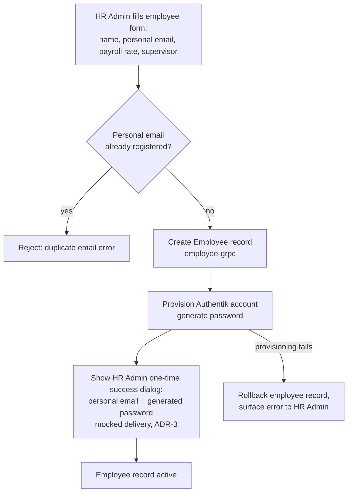

<!-- Story: #KAN-2 — Employee Registration & Profile Management -->
<!-- Type: flowchart -->
<!-- Generated: 2026-08-10 -->

```mermaid
flowchart TD
    A[HR Admin fills employee form:<br/>name, personal email, payroll rate, supervisor] --> B{Personal email<br/>already registered?}
    B -- yes --> C[Reject: duplicate email error]
    B -- no --> D[Create Employee record<br/>employee-grpc]
    D --> E[Provision Authentik account<br/>generate password]
    E --> F[Show HR Admin one-time success dialog:<br/>personal email + generated password<br/>mocked delivery, ADR-3]
    F --> G[Employee record active]
    E -- provisioning fails --> H[Rollback employee record,<br/>surface error to HR Admin]
```
