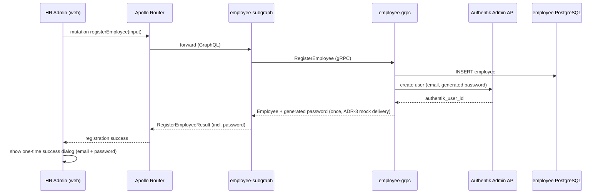

<!-- Story: #KAN-2 — Employee Registration & Profile Management -->
<!-- Type: sequence-diagram -->
<!-- Generated: 2026-08-10 -->

```mermaid
sequenceDiagram
    participant HR as HR Admin (web)
    participant Router as Apollo Router
    participant EmpSub as employee-subgraph
    participant EmpGrpc as employee-grpc
    participant Auth as Authentik Admin API
    participant DB as employee PostgreSQL

    HR->>Router: mutation registerEmployee(input)
    Router->>EmpSub: forward (GraphQL)
    EmpSub->>EmpGrpc: RegisterEmployee (gRPC)
    EmpGrpc->>DB: INSERT employee
    EmpGrpc->>Auth: create user (email, generated password)
    Auth-->>EmpGrpc: authentik_user_id
    EmpGrpc-->>EmpSub: Employee + generated password (once, ADR-3 mock delivery)
    EmpSub-->>Router: RegisterEmployeeResult (incl. password)
    Router-->>HR: registration success
    HR->>HR: show one-time success dialog (email + password)
```
