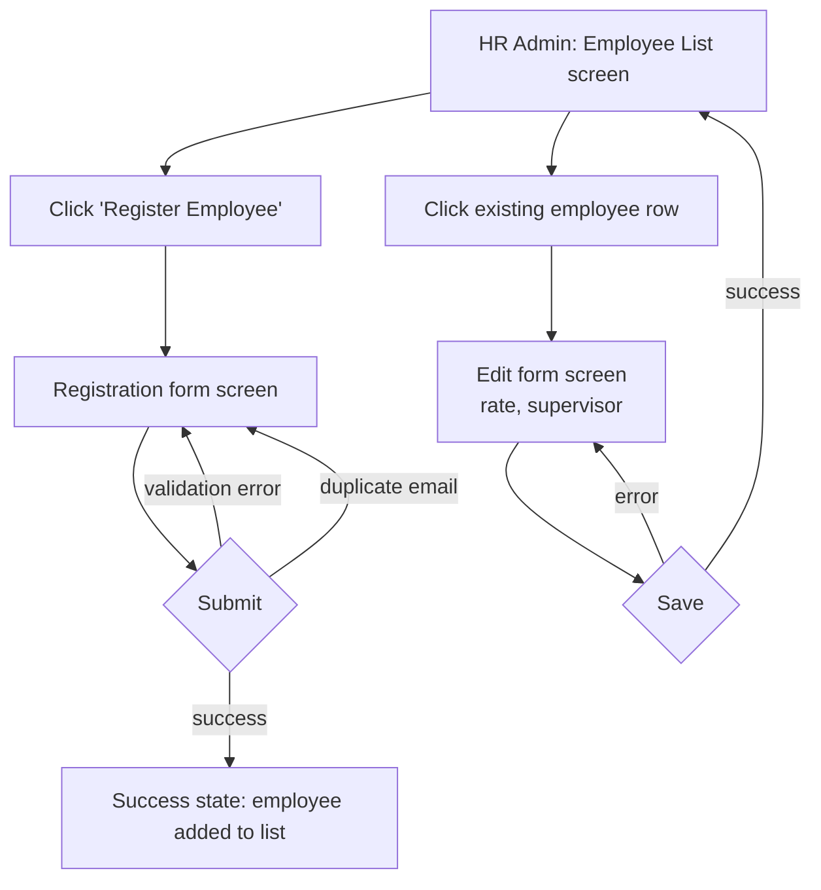

<!-- Story: #KAN-2 — Employee Registration & Profile Management -->

```mermaid
flowchart TD
    Start[HR Admin: Employee List screen] --> New[Click 'Register Employee']
    New --> Form[Registration form screen]
    Form --> Submit{Submit}
    Submit -- validation error --> Form
    Submit -- duplicate email --> Form
    Submit -- success --> Success[Success state: employee added to list]
    Start --> EditEntry[Click existing employee row]
    EditEntry --> EditForm[Edit form screen<br/>rate, supervisor]
    EditForm --> SaveEdit{Save}
    SaveEdit -- success --> Start
    SaveEdit -- error --> EditForm
```
