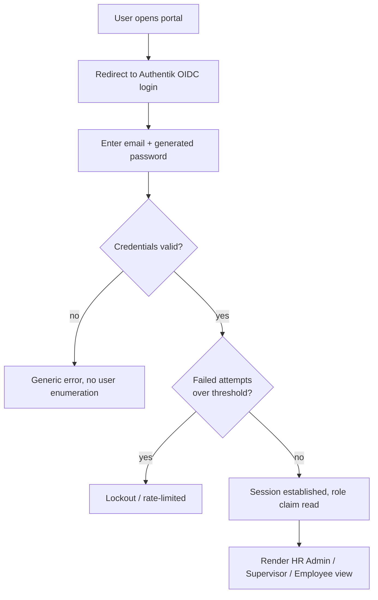

<!-- Story: #KAN-3 — Authentik Login for Employees -->
<!-- Type: flowchart -->
<!-- Generated: 2026-08-10 -->

```mermaid
flowchart TD
    A[User opens portal] --> B[Redirect to Authentik OIDC login]
    B --> C[Enter email + generated password]
    C --> D{Credentials valid?}
    D -- no --> E[Generic error, no user enumeration]
    D -- yes --> F{Failed attempts<br/>over threshold?}
    F -- yes --> G[Lockout / rate-limited]
    F -- no --> H[Session established, role claim read]
    H --> I[Render HR Admin / Supervisor / Employee view]
```
