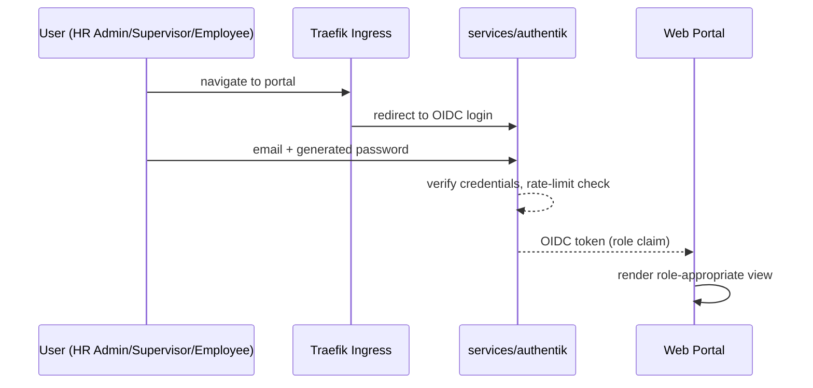

<!-- Story: #KAN-3 — Authentik Login for Employees -->
<!-- Type: sequence-diagram -->
<!-- Generated: 2026-08-10 -->

```mermaid
sequenceDiagram
    participant U as User (HR Admin/Supervisor/Employee)
    participant Traefik as Traefik Ingress
    participant Authentik as services/authentik
    participant Web as Web Portal

    U->>Traefik: navigate to portal
    Traefik->>Authentik: redirect to OIDC login
    U->>Authentik: email + generated password
    Authentik-->>Authentik: verify credentials, rate-limit check
    Authentik-->>Web: OIDC token (role claim)
    Web->>Web: render role-appropriate view
```
