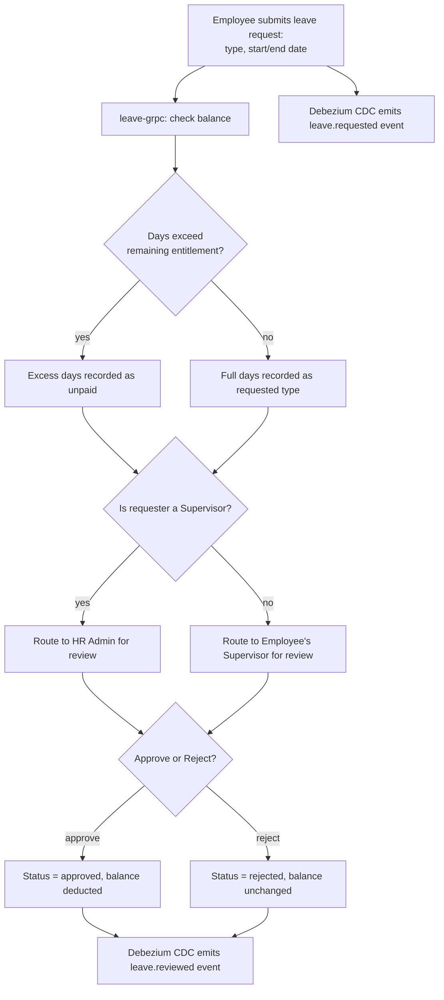

<!-- Story: #KAN-4 — Leave Request, Approval & Balance Tracking -->
<!-- Type: flowchart -->
<!-- Generated: 2026-08-10 -->

```mermaid
flowchart TD
    A[Employee submits leave request:<br/>type, start/end date] --> B[leave-grpc: check balance]
    B --> C{Days exceed<br/>remaining entitlement?}
    C -- yes --> D[Excess days recorded as unpaid]
    C -- no --> E[Full days recorded as requested type]
    D --> F{Is requester a Supervisor?}
    E --> F
    F -- yes --> G[Route to HR Admin for review]
    F -- no --> H[Route to Employee's Supervisor for review]
    G --> I{Approve or Reject?}
    H --> I
    I -- approve --> J[Status = approved, balance deducted]
    I -- reject --> K[Status = rejected, balance unchanged]
    J --> L[Debezium CDC emits leave.reviewed event]
    K --> L
    A --> M[Debezium CDC emits leave.requested event]
```
