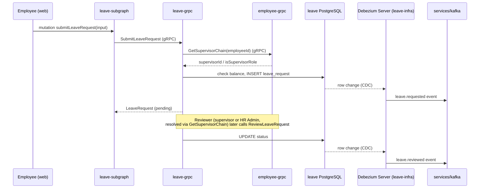

<!-- Story: #KAN-4 — Leave Request, Approval & Balance Tracking -->
<!-- Type: sequence-diagram -->
<!-- Generated: 2026-08-10 -->

```mermaid
sequenceDiagram
    participant Emp as Employee (web)
    participant LeaveSub as leave-subgraph
    participant LeaveGrpc as leave-grpc
    participant EmpGrpc as employee-grpc
    participant DB as leave PostgreSQL
    participant Dbz as Debezium Server (leave-infra)
    participant Kafka as services/kafka

    Emp->>LeaveSub: mutation submitLeaveRequest(input)
    LeaveSub->>LeaveGrpc: SubmitLeaveRequest (gRPC)
    LeaveGrpc->>EmpGrpc: GetSupervisorChain(employeeId) (gRPC)
    EmpGrpc-->>LeaveGrpc: supervisorId / isSupervisorRole
    LeaveGrpc->>DB: check balance, INSERT leave_request
    DB-->>Dbz: row change (CDC)
    Dbz->>Kafka: leave.requested event
    LeaveGrpc-->>LeaveSub: LeaveRequest (pending)

    Note over LeaveGrpc,EmpGrpc: Reviewer (supervisor or HR Admin,<br/>resolved via GetSupervisorChain) later calls ReviewLeaveRequest
    LeaveGrpc->>DB: UPDATE status
    DB-->>Dbz: row change (CDC)
    Dbz->>Kafka: leave.reviewed event
```
