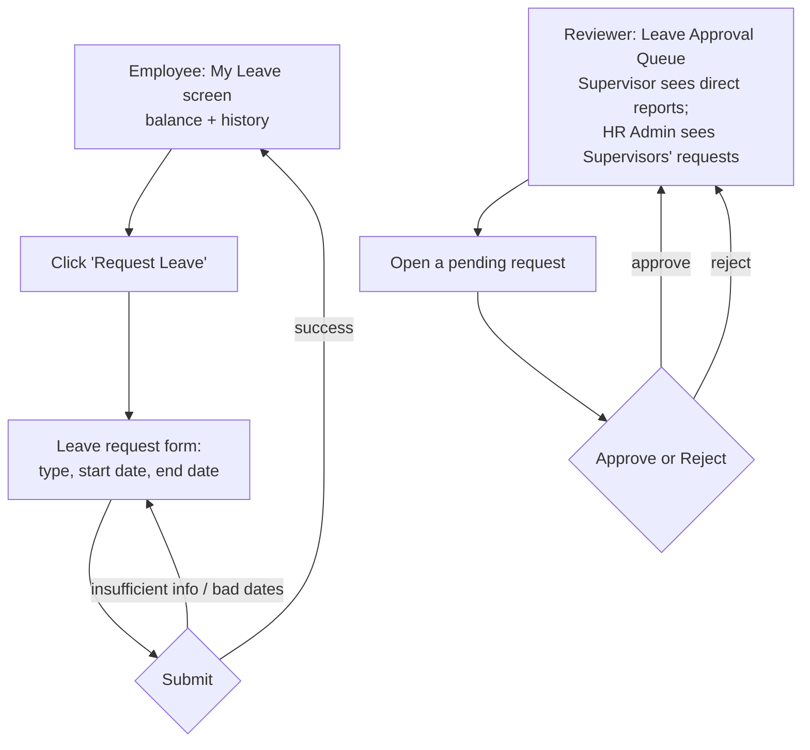

<!-- Story: #KAN-4 — Leave Request, Approval & Balance Tracking -->

```mermaid
flowchart TD
    Start[Employee: My Leave screen<br/>balance + history] --> New[Click 'Request Leave']
    New --> Form[Leave request form:<br/>type, start date, end date]
    Form --> Submit{Submit}
    Submit -- insufficient info / bad dates --> Form
    Submit -- success --> Start

    Rev[Reviewer: Leave Approval Queue<br/>Supervisor sees direct reports;<br/>HR Admin sees Supervisors' requests] --> Open[Open a pending request]
    Open --> Decide{Approve or Reject}
    Decide -- approve --> Rev
    Decide -- reject --> Rev
```
