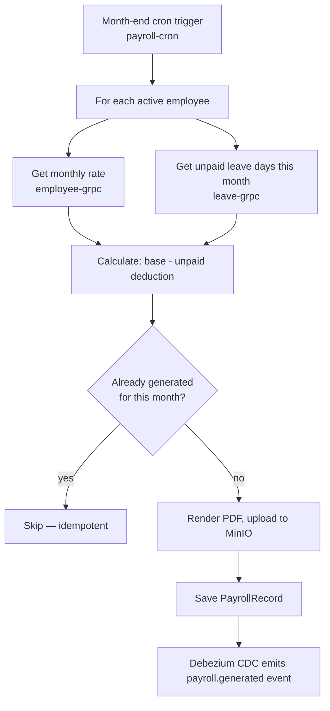

<!-- Story: #KAN-5 — Monthly Automated Payroll Generation -->
<!-- Type: flowchart -->
<!-- Generated: 2026-08-10 -->

```mermaid
flowchart TD
    A[Month-end cron trigger<br/>payroll-cron] --> B[For each active employee]
    B --> C[Get monthly rate<br/>employee-grpc]
    B --> D[Get unpaid leave days this month<br/>leave-grpc]
    C --> E[Calculate: base - unpaid deduction]
    D --> E
    E --> F{Already generated<br/>for this month?}
    F -- yes --> G[Skip — idempotent]
    F -- no --> H[Render PDF, upload to MinIO]
    H --> I[Save PayrollRecord]
    I --> J[Debezium CDC emits payroll.generated event]
```
