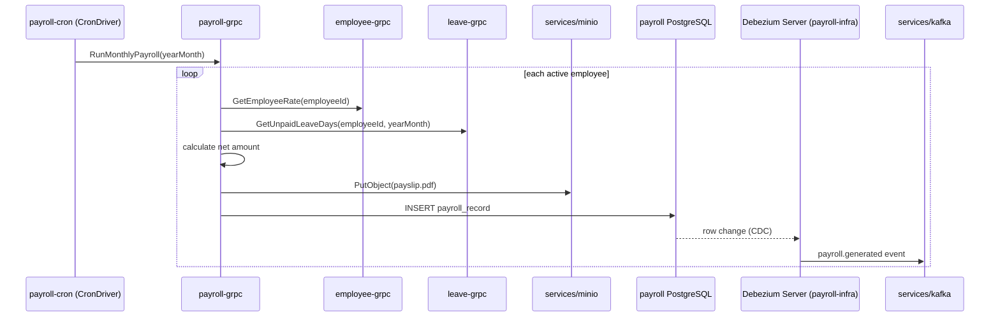

<!-- Story: #KAN-5 — Monthly Automated Payroll Generation -->
<!-- Type: sequence-diagram -->
<!-- Generated: 2026-08-10 -->

```mermaid
sequenceDiagram
    participant Cron as payroll-cron (CronDriver)
    participant PayrollGrpc as payroll-grpc
    participant EmpGrpc as employee-grpc
    participant LeaveGrpc as leave-grpc
    participant MinIO as services/minio
    participant DB as payroll PostgreSQL
    participant Dbz as Debezium Server (payroll-infra)
    participant Kafka as services/kafka

    Cron->>PayrollGrpc: RunMonthlyPayroll(yearMonth)
    loop each active employee
        PayrollGrpc->>EmpGrpc: GetEmployeeRate(employeeId)
        PayrollGrpc->>LeaveGrpc: GetUnpaidLeaveDays(employeeId, yearMonth)
        PayrollGrpc->>PayrollGrpc: calculate net amount
        PayrollGrpc->>MinIO: PutObject(payslip.pdf)
        PayrollGrpc->>DB: INSERT payroll_record
        DB-->>Dbz: row change (CDC)
        Dbz->>Kafka: payroll.generated event
    end
```
