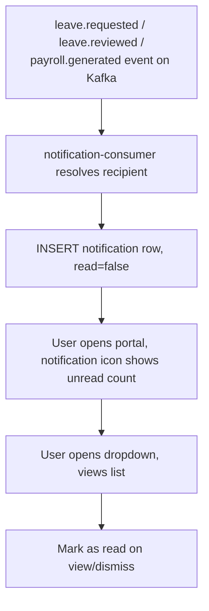

<!-- Story: #KAN-6 — In-App Notifications -->
<!-- Type: flowchart -->
<!-- Generated: 2026-08-10 -->

```mermaid
flowchart TD
    A[leave.requested / leave.reviewed /<br/>payroll.generated event on Kafka] --> B[notification-consumer resolves recipient]
    B --> C[INSERT notification row, read=false]
    C --> D[User opens portal, notification icon shows unread count]
    D --> E[User opens dropdown, views list]
    E --> F[Mark as read on view/dismiss]
```
