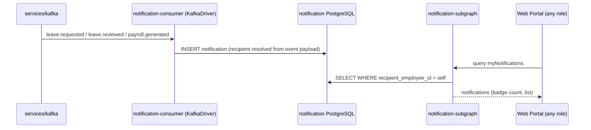

<!-- Story: #KAN-6 — In-App Notifications -->
<!-- Type: sequence-diagram -->
<!-- Generated: 2026-08-10 -->

```mermaid
sequenceDiagram
    participant Kafka as services/kafka
    participant NotifKafka as notification-consumer (KafkaDriver)
    participant DB as notification PostgreSQL
    participant NotifSub as notification-subgraph
    participant Web as Web Portal (any role)

    Kafka->>NotifKafka: leave.requested / leave.reviewed / payroll.generated
    NotifKafka->>DB: INSERT notification (recipient resolved from event payload)
    Web->>NotifSub: query myNotifications
    NotifSub->>DB: SELECT WHERE recipient_employee_id = self
    NotifSub-->>Web: notifications (badge count, list)
```
