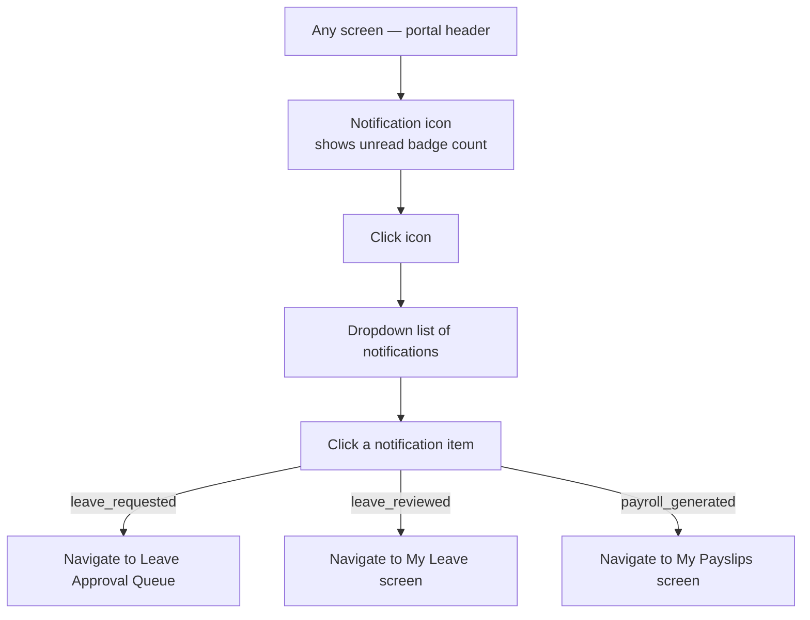

<!-- Story: #KAN-6 — In-App Notifications -->

```mermaid
flowchart TD
    Any[Any screen — portal header] --> Icon[Notification icon<br/>shows unread badge count]
    Icon --> Open[Click icon]
    Open --> Dropdown[Dropdown list of notifications]
    Dropdown --> Item[Click a notification item]
    Item -- leave_requested --> NavApproval[Navigate to Leave Approval Queue]
    Item -- leave_reviewed --> NavLeave[Navigate to My Leave screen]
    Item -- payroll_generated --> NavPayslip[Navigate to My Payslips screen]
```
