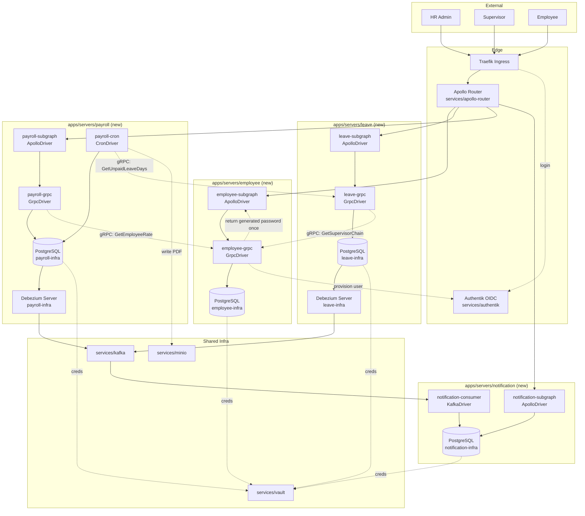

<!-- Change: hr-leave-payroll-platform -->
<!-- Type: system-architecture -->
<!-- Generated: 2026-08-10 -->

# System Architecture — after hr-leave-payroll-platform

First system-architecture diagram in this repo (no prior services scaffolded) — drawn fresh, not incremental.

## Notes
- 4 new servers: `employee`, `leave`, `payroll`, `notification` — none exist yet, all scaffolded via `turbo gen server` post-`/kickoff`.
- Notifications are CDC-driven (Debezium → Kafka), not app-level event publish — see ADR-2.
- Credential delivery is mocked (one-time success dialog in `hr-portal`, not a real email) — see ADR-3.
